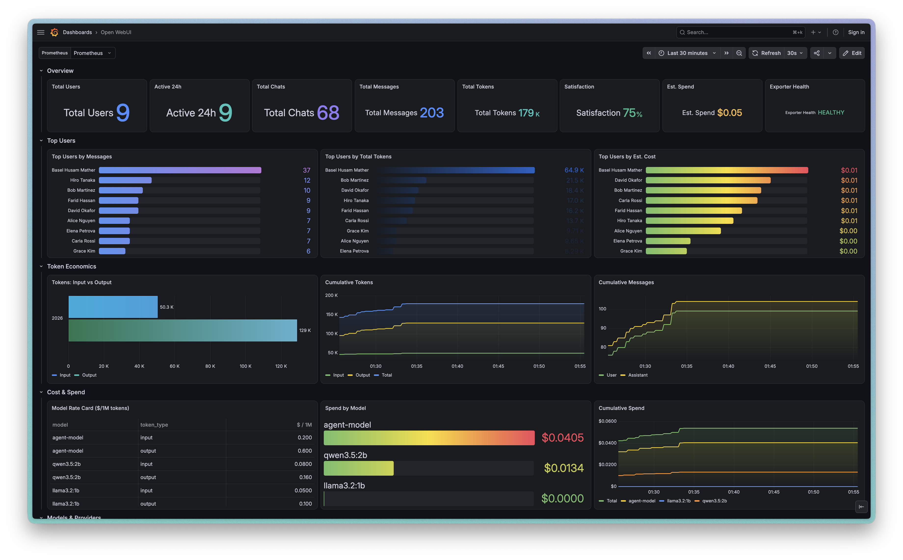
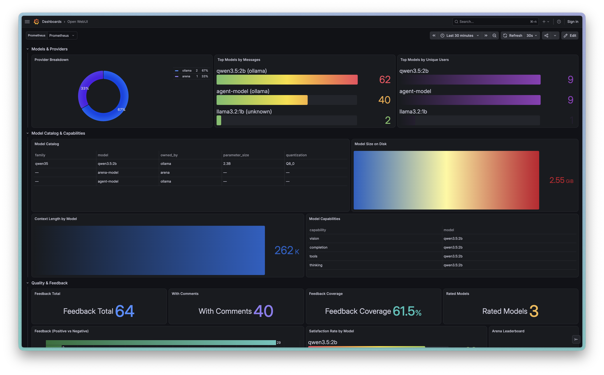
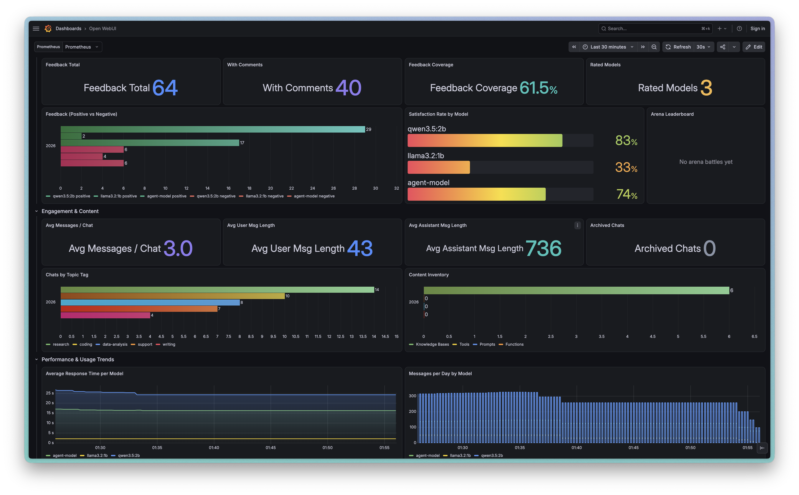

# Open WebUI Prometheus Exporter

<p align="center">
  
</p>

<p align="center">
  <a href="https://baselhusam.github.io/open-webui-exporter/"></a>
  <a href="https://github.com/baselhusam/open-webui-exporter/pkgs/container/open-webui-exporter"></a>
  <a href="https://hub.docker.com/r/baselhusam/open-webui-exporter"></a>
  <!-- TODO: replace with the real grafana.com dashboard URL once the upload is published. -->
  <a href="https://grafana.com/grafana/dashboards/00000-open-webui-exporter/"></a>
  <a href="LICENSE"></a>
</p>

Polls Open WebUI's REST API and exposes Prometheus metrics on `/metrics` (default port `9090`). Ships with a ready-made Grafana dashboard.

**[📖 Documentation & screenshots →](https://baselhusam.github.io/open-webui-exporter/)**



No first-party `/metrics` endpoint exists in Open WebUI, and the existing community exporter (`ncecere/exporter-openwebui`) requires direct PostgreSQL access. This exporter instead uses Open WebUI's REST API (including its built-in `/api/v1/analytics/*` endpoints), so it works with any backend (SQLite or Postgres) and needs no database credentials.

## 1. Generate an API key

In Open WebUI: **Settings → Account → API Keys → Create new key.** (If you don't see API Keys, enable it first under **Admin Settings → General → Enable API Key**.)

## 2. Configure

Copy `.env.example` to `.env` and fill in:

```
OPENWEBUI_BASE_URL=http://localhost:3000
OPENWEBUI_API_KEY=<your key>
POLL_INTERVAL_SECONDS=30
EXPORTER_PORT=9090

# Optional: override the per-model price table (see "Pricing" below).
# MODEL_PRICES_CSV=/etc/openwebui-exporter/model_prices.csv
# MODEL_PRICES_FILE=/etc/openwebui-exporter/prices.json

# Fallback $/1k-token rate for models with no price-table entry.
COST_PER_1K_INPUT_TOKENS=0
COST_PER_1K_OUTPUT_TOKENS=0
```

Use an **admin** API key — several metrics come from admin-wide endpoints (all users' analytics, feedback, and chats).

## Pricing

Open WebUI reports token counts but never what a request cost, so spend is reconstructed from a rate table in [`pricing.py`](pricing.py). It ships with published **list prices (snapshot: July 2026, `$` per 1M tokens)** for the SOTA models from the major providers — OpenAI, Anthropic, Google, xAI, DeepSeek, Alibaba Qwen, Z.ai/GLM, Mistral — each with `input` / `output` and, where the provider offers prompt caching, `cache_read` / `cache_write` rates. The **local Ollama** entries are **mock prices** (real local inference is free) so a local-only instance still shows a non-zero cost signal. Lookup is exact-match first, then longest prefix, so `gpt-4o-2024-11-20` resolves to the `gpt-4o` row.

Published prices drift and your negotiated rates may differ, so **override the table without touching code** — both sources merge on top of the built-in defaults, and only the models you list change:

**CSV price sheet (recommended, Excel-friendly).** Copy the template and edit it:

```bash
cp model_prices.example.csv model_prices.csv   # then edit in Excel / any editor
```

The template ([`model_prices.example.csv`](model_prices.example.csv)) documents every column:

| column | meaning |
|--------|---------|
| `model` | model id exactly as Open WebUI reports it, e.g. `gpt-5.6`, `claude-opus-4-8` (prefix-matched, so `gpt-4o` also covers `gpt-4o-2024-11-20`) |
| `provider` | free-text label (`openai`, `anthropic`, …) — optional |
| `input_per_1m` | `$` per 1M prompt tokens **(required)** |
| `output_per_1m` | `$` per 1M completion tokens **(required)** |
| `cache_read_per_1m` | `$` per 1M cached-prompt tokens on a cache hit — `0` if n/a |
| `cache_write_per_1m` | `$` per 1M tokens to write the prompt cache — `0` if n/a |

Point the exporter at it with `MODEL_PRICES_CSV=/path/to/model_prices.csv`. **With Docker Compose**, set two vars in `.env` — the host path to mount and the in-container path to read:

```
MODEL_PRICES_CSV_HOST=./model_prices.csv
MODEL_PRICES_CSV=/etc/openwebui-exporter/model_prices.csv
```

(The exporter compose file mounts `MODEL_PRICES_CSV_HOST` read-only into the container; it defaults to the shipped example so `up` never fails on a missing file, and the sheet is only *read* when `MODEL_PRICES_CSV` points at it.)

**JSON file** (alternative): `MODEL_PRICES_FILE` pointing at `{"gpt-4o": [2.50, 10.00], "llama3.2:1b": [0, 0]}` — two values, or four to include `[input, output, cache_read, cache_write]`.

When a backend reports cached prompt tokens (e.g. `prompt_tokens_details.cached_tokens`), that portion is billed at the model's `cache_read` rate instead of full input. In Grafana the rates surface in the **Model Rate Card** panel (`input`/`output`, plus `cache_read`/`cache_write` for models that have them).

## 3. Run standalone (using the existing `.venv`)

```bash
.venv/bin/pip install -r requirements.txt
export $(cat .env | xargs)
.venv/bin/python exporter.py
curl http://localhost:9090/metrics
```

## 4. Run with Docker (pre-built image)

Published images are built by CI for `linux/amd64` and `linux/arm64` and pushed to
both registries — no need to build from the `Dockerfile` yourself. Pick either:

| Registry | Image |
|----------|-------|
| [GitHub Container Registry](https://github.com/baselhusam/open-webui-exporter/pkgs/container/open-webui-exporter) | `ghcr.io/baselhusam/open-webui-exporter:latest` |
| [Docker Hub](https://hub.docker.com/r/baselhusam/open-webui-exporter) | `docker.io/baselhusam/open-webui-exporter:latest` |

Tags: `latest`, semver (`0.1.0`, `0.1`), and per-commit `sha-<short>` for immutable pinning.

### Single container

```bash
docker run -d \
  --name openwebui-exporter \
  -p 9090:9090 \
  --add-host host.docker.internal:host-gateway \
  -e OPENWEBUI_BASE_URL=http://host.docker.internal:3000 \
  -e OPENWEBUI_API_KEY=<your key> \
  ghcr.io/baselhusam/open-webui-exporter:latest

curl http://localhost:9090/metrics
```

`--add-host host.docker.internal:host-gateway` lets the container reach an Open WebUI
running on the host; if Open WebUI runs elsewhere, point `OPENWEBUI_BASE_URL` at it
directly and drop the `--add-host` flag. Swap the image reference for the Docker Hub
one above to pull from Docker Hub instead.

## 5. Run with Docker Compose

Three compose files, each runnable on its own, so you always know what's running:

| File | Project | Services | Ports (host) |
|------|---------|----------|--------------|
| `docker-compose.yml` | `openwebui-exporter` | the exporter alone | exporter `9090` |
| `docker-compose.monitoring.yml` | `openwebui-monitoring` | exporter · Prometheus · Grafana | exporter `9090`, Prometheus `9091`, Grafana `3001` |
| `docker-compose.openwebui.yml` | `openwebui-app` | Open WebUI (only if you need one) | Open WebUI `3000` |

All of them **pull the published exporter image** (GHCR by default) rather than
building it locally. The monitoring file `extends` the exporter service out of
`docker-compose.yml`, so the exporter is configured in exactly one place.

**Already have Open WebUI and your own Prometheus?** Just the exporter:

```bash
docker compose up -d                                    # http://localhost:9090/metrics
```

**Want the batteries-included stack** (exporter + Prometheus + pre-built dashboard):

```bash
docker compose -f docker-compose.monitoring.yml up -d   # Grafana http://localhost:3001
```

Run one or the other, not both — they share the exporter's container name and port
9090.

**No Open WebUI yet?** Bring one up first, then either exporter stack:

```bash
docker compose -f docker-compose.openwebui.yml up -d    # http://localhost:3000
```

To pull from Docker Hub instead, or to pin a specific version, set `EXPORTER_IMAGE`
(in `.env` or the shell) before bringing a stack up:

```bash
EXPORTER_IMAGE=docker.io/baselhusam/open-webui-exporter:latest \
  docker compose -f docker-compose.monitoring.yml up -d
```

The stacks are fully separate (different compose projects) — they never share
networks or volumes and never orphan each other. The exporter reaches Open WebUI
over the host (`host.docker.internal:3000`), so start Open WebUI first; if yours
runs somewhere else, point `OPENWEBUI_BASE_URL` in `docker-compose.yml` at it.

Tear any of them down independently (data is kept in named volumes):

```bash
docker compose -f docker-compose.monitoring.yml down   # stop monitoring only
docker compose -f docker-compose.openwebui.yml down    # stop Open WebUI only
```

## 6. Prometheus & Grafana are pre-configured

Bringing up `docker-compose.monitoring.yml` wires everything automatically:

- **Prometheus** scrapes the exporter using `prometheus/prometheus.yml` (target `openwebui-exporter:9090`).
- **Grafana** is provisioned from `grafana/provisioning/` — the Prometheus datasource and the `grafana/dashboard.json` dashboard load on startup (open http://localhost:3001, no login in local dev). Anonymous admin is enabled for convenience; remove the `GF_AUTH_*` vars for shared deployments.

To import the dashboard into a **different** Grafana manually: **Dashboards → New → Import**, upload `grafana/dashboard.json`, and pick your Prometheus datasource. You can also grab it straight from the grafana.com catalog — [**Open WebUI Exporter dashboard →**](https://grafana.com/grafana/dashboards/00000-open-webui-exporter/) — by pasting its ID into the same Import screen. The dashboard layout is generated by `grafana/build_dashboard.py`, which emits both `dashboard.json` and `dashboard.grafana-com.json` (the variant for the grafana.com community catalog) — rerun it after editing rather than hand-editing either file. Sections: hero KPIs (users, chats, messages, tokens, satisfaction, estimated spend, health); top users by messages / tokens / cost (labelled by name); token economics (input-vs-output, cumulative trends); models & providers (breakdown, top models, unique users); model catalog & capabilities (size, context length, family/quantization, vision/tools/thinking); quality & feedback (satisfaction rate per model, feedback coverage, comments, Arena leaderboard); engagement & content (avg messages/chat, message lengths, topic tags, knowledge/tools/prompts/functions); performance & usage trends; and exporter self-health/scrape errors.

### Dashboard tour

**Overview, top users, token economics & cost/spend** — hero KPI tiles, per-user leaderboards, input-vs-output token trends, and the model rate card driving estimated spend:


**Models & providers, model catalog & capabilities** — provider split, top models by messages/users, the model catalog table, size on disk, context length, and per-model capabilities:



**Quality & feedback, engagement & content, usage trends** — feedback totals and satisfaction per model, average messages/lengths, topic tags, content inventory, response times, and messages-per-day:



## Seed demo data

To see the dashboard populated with realistic multi-user activity, `scripts/` can
create (and later remove) mock users, groups, knowledge bases, chats across several
models, and feedback — all through Open WebUI's REST API, no model inference:

```bash
export $(cat .env | xargs)
# Run from the host, so override BASE_URL to localhost (the .env value points the
# exporter *container* at host.docker.internal, which won't resolve on the host):
OPENWEBUI_BASE_URL=http://localhost:3000 .venv/bin/python scripts/seed_mock_data.py
OPENWEBUI_BASE_URL=http://localhost:3000 .venv/bin/python scripts/teardown_mock_data.py
```

Mock data is namespaced (`@mock.local` emails, `[mock]`-suffixed groups/KBs); teardown
removes exactly that and leaves real data untouched.

## Notes

- `/api/v1/users/` is fetched as a single page; on instances with very large user counts, pagination may need to be added to `collectors/users.py`.
- **Endpoint scope:** analytics and feedback are admin-wide, but `/api/v1/chats/stats/usage` is scoped to the *calling* user. To get true cross-user totals, `collectors/chats.py` aggregates chat/message/tag/response-time stats from the admin-wide `/api/v1/chats/all/db` (a heavier per-poll fetch of full chat objects). Per-user token counts come from `/api/v1/analytics/users`; `/api/v1/analytics/models` has no per-model token data.
- **Cost is estimated, not reported.** Open WebUI exposes token counts but never prices, so `pricing.py` holds a per-model rate table (`$/1M` tokens) and `collectors/chats.py` applies it to each assistant message's `usage` block. The local-Ollama entries in that table are **mock prices** — invented so a local-only instance still produces a non-zero cost signal; replace them (see [Pricing](#pricing) — a CSV price sheet or `MODEL_PRICES_FILE`) before treating the numbers as real. In Grafana the prices surface in the **Cost & Spend** row: *Model Rate Card* (the table itself), *Spend by Model*, *Cumulative Spend*, plus the *Est. Spend* hero tile and *Top Users by Est. Cost*.
- Feedback counts (`collectors/feedback.py`) are aggregated from `/api/v1/evaluations/feedbacks/all/export` (admin-only), tallying each `rating` record's `+1`/`-1` per model (and a per-model satisfaction ratio). The Arena `/api/v1/evaluations/leaderboard` stays empty until users run side-by-side battles (separate from thumbs up/down), so that panel shows "No arena battles yet" until then.
- The exporter tolerates individual endpoint failures: a bad API key or one down endpoint increments `openwebui_exporter_scrape_errors_total{endpoint=...}` and sets `openwebui_exporter_scrape_success` to 0, rather than crashing the process.

## Author

Built by [Basel Husam](https://baselhusam.com).

## License

[MIT](LICENSE) © [Basel Husam](https://baselhusam.com)
